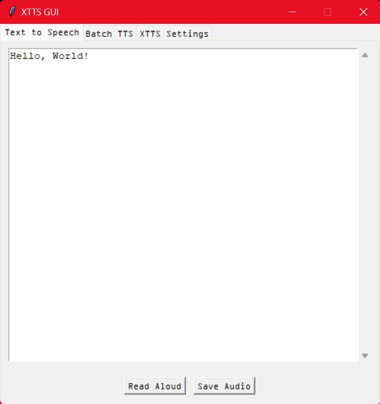
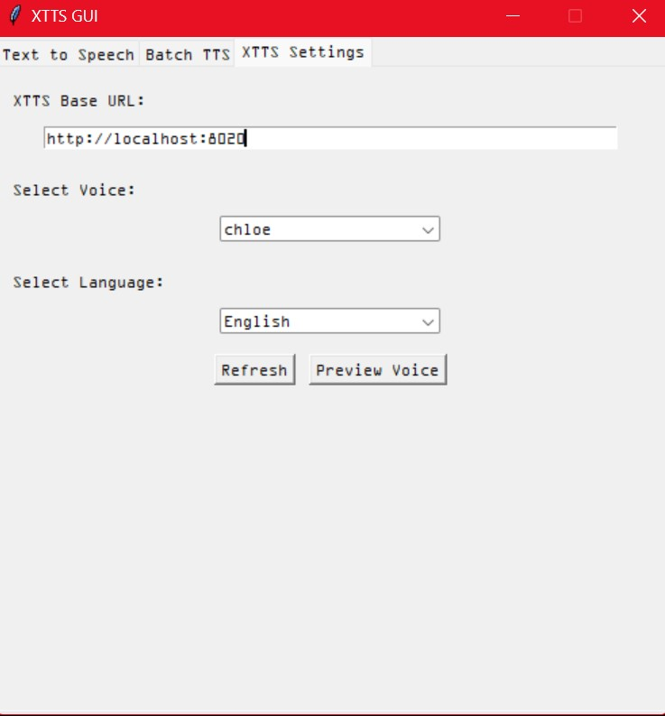

ABOUT:
This program is designed to provide a graphical user interface for the xtts_api_server project: https://github.com/daswer123/xtts-api-server
It allows you to connect to the xtts server and use it's functions through a nice GUI. The GUI allows you to choose from a list of available voices and supported languages (loaded from the server endpoint) and playback text-to-speech audio directly through the GUI. It also supports saving tts text to .wav files into a folder of your choice. 

 

USE:
Please first install the xtts_api_server onto your machine and have it running for this GUI. You will also need to have a copy of ffmpeg installed (and setup with an environment path variable for python to see it).

ffmpeg can be found here: https://ffmpeg.org/

A nice YouTube tutorial on how to install and setup ffmpeg can be found here: https://www.youtube.com/watch?v=eRZRXpzZfM4

NOTE:
This program is a graphical interface for the xtts_api_server project. I do not own or distribute the xtts_api_server, FFmpeg, or any content in the referenced YouTube tutorial. FFmpeg is a third-party software, available under its own license, and the YouTube video is owned by its respective creator. Users are responsible for complying with the licenses and terms of use of these third-party tools. This program is provided "as-is" without any warranty, express or implied.
